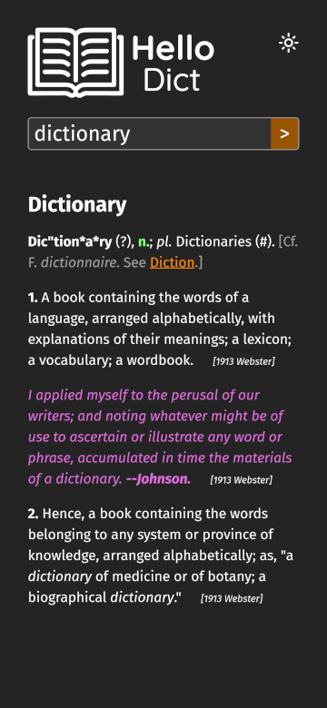
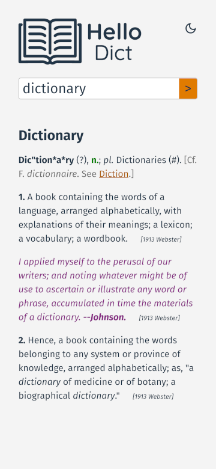

# Hello Dict

Dictionary coded in React.js. Just type in the word in the box and search.

Coded with ❤️ by WC Leung.

## Demo

- [Launch HelloDict](https://hellodict.pages.dev)
- [Lookup for the word ‘dictionary’](https://hellodict.pages.dev/#/word/dictionary)
- [Search for pattern ‘h\*ll?’](https://hellodict.pages.dev/#/search/h*ll%3F)

## Features

- Wildcard pattern search with ‘\*’ (zero or more unknown characters) and ‘?’
  (one unknown character).
- Privacy friendly. The whole dictionary is downloaded right into your web app.
  Dictionary lookups are NOT sent online.
- Friendly to both desktop and mobile devices.
- Dark mode.
- Shareable links for your dictionary lookups. (See
  [this](https://en.wikipedia.org/wiki/URI_fragment) to know how privacy works
  with these links.)

## Screenshots

## Tech stack

- React, TypeScript and Vite
- EsLint and Prettier for linting and formatting
- ViTest for unit testing and component testing
- Cypress for end-to-end testing
- GitHub Actions for continuous integration
- Netlify for continuous delivery

## Handling of dictionary data

The data in the app is fetched from https://github.com/lwchkg/hello-dict-data
using jsDelivr CDN, which has a size of about 10.3 MB after compression. The
whole dictionary is downloaded onto your computer when the app loads.

To save bandwidth, the same dictionary data file is never fetched again unless
your browser cache is cleared.

Considering the large size of the dictionary data, it is handled by a web worker
to avoid blocking the UI.

## Credits

Dictionary data from
[GNU Collaborative International Dictionary of English](https://gcide.gnu.org.ua/),
version 0.51.

The OneIdentity ZSTD library (https://github.com/OneIdentity/zstd-js) for their
compression library.

## To-dos

- Use SharedWorker to save memory and processing across multiple browser tabs
  (it costs 200 MB per tab now, or 500 MB when dictionary data is loading).
- Find similar words if there is no match.
- Add WordNet data.
- Transform the word with the WordNet algorithm (e.g. studies -> study) before
  doing the dictionary lookup.
